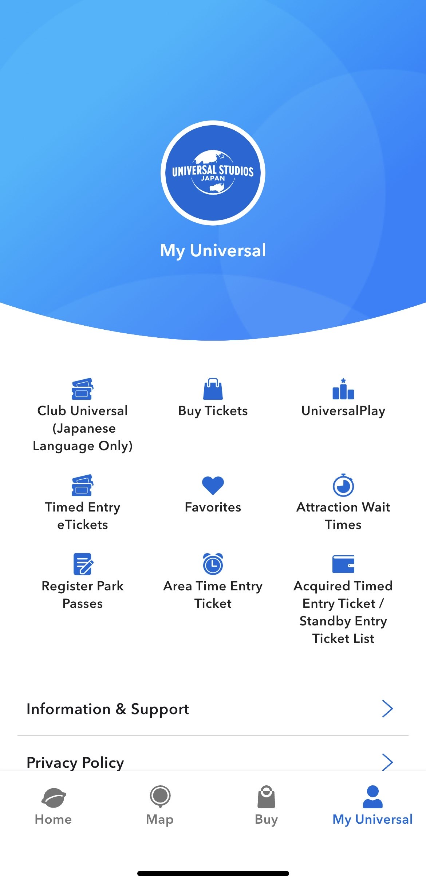
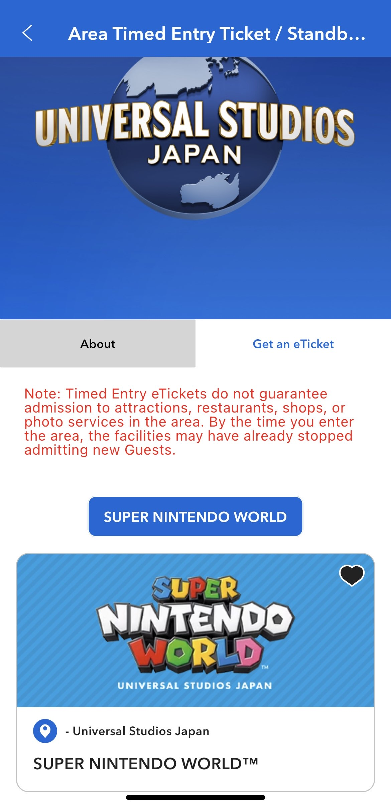
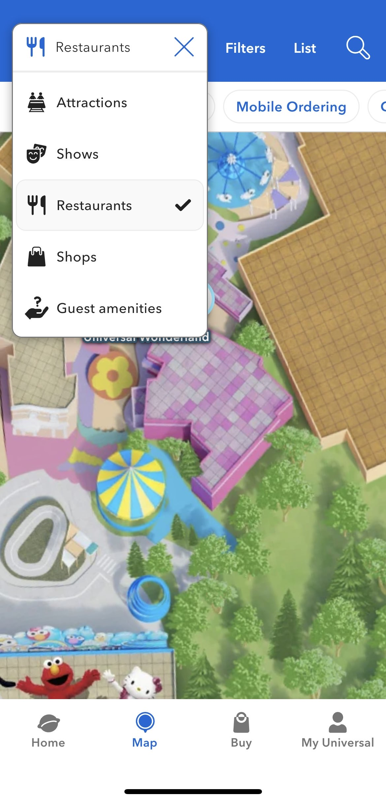
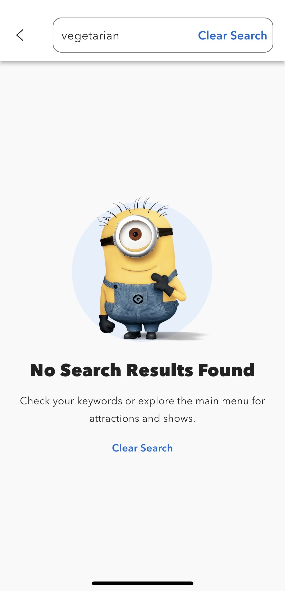
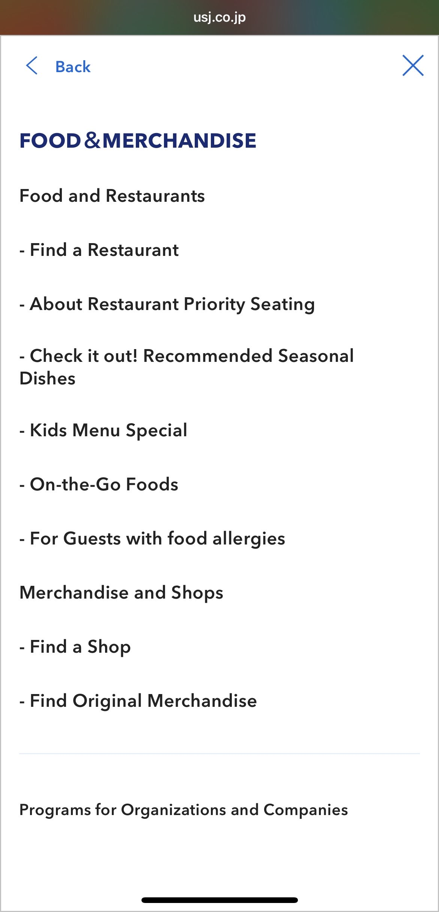
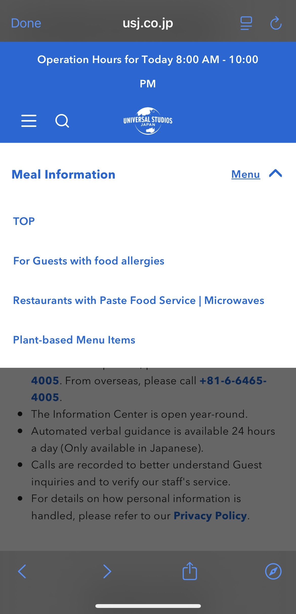
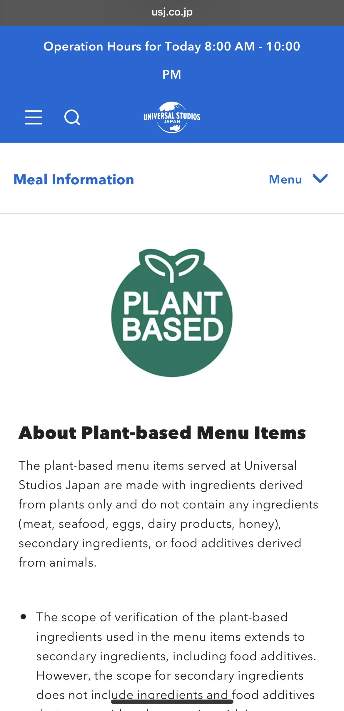
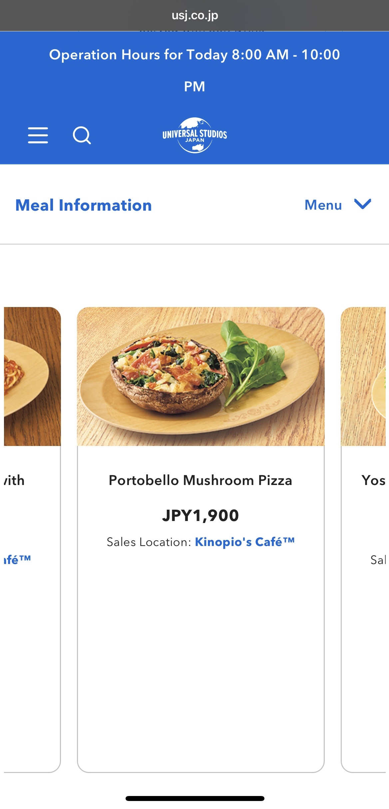
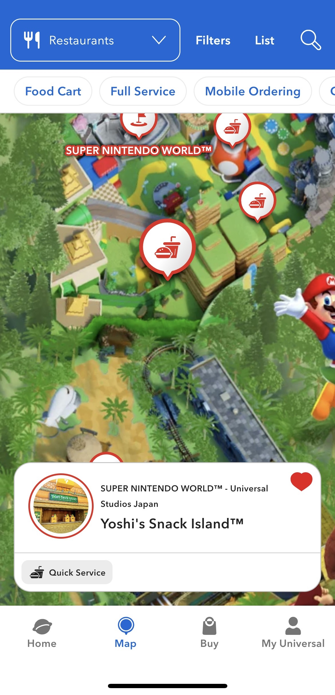

# Not so Universal

This last winter break I went on vacation to Japan. While in Osaka, a city in the South-West, my partner and I went to the Universal Studios amusement park. He had never been and we were very excited to see the new Super Mario world. Upon entry into the park we were informed that we had to register to sign up for a time slot to be able to enter the Super Mario portion of the park, it is a quite popular attraction. After much fruitless googling we went to customer support to find out how to do this and were directed to the **USJ (Universal Studios Japan)** application, the only way to sign up for any special events or areas was to have the park app. So we had to download the application, then we had to make an account for the application, then we had to register our park ticket with the application to prove we were in the park that day. 

* This is a photo of the User home screen for the USJ app.

* This is a photo of the page to reserve a time at the Super Mario World area.

At this point I felt the app had a lower satisfaction and efficiency and was a bit annoyed that an application was required for most of the interaction with the park. However it was efficient to have a digital map of the park to find attractions and nearby bathrooms. 

* This is a photo of part of the USJ map and the filter for types of things to find in the park (Bathrooms, rides, etc).

However an issue arose trying to navigate the application to find food. My partner is vegetarian with some food allergies, which was surprisingly easy to navigate in Japan. We were trying to find a place that served vegetarian food, the map allows you to filter the map search for food places. Unfortunately the search function does not recognise vegetarian as a query, so I could select a restaurant/food stall to try to see what they had but that would take way longer than we had patience for. 

* This is a photo of the search filter that did not recognize vegetarian as a possible query. It is possible it doesn't recognize food types at all which goes against the **mental model** I had when interacting with it.

When  you click on the stall it pops up with a window to be able to see the menu, which re-directs to the USJ website. So I was able to find at the main menu in the upper left hand corner which did match with the expected position. It had a "Food & Merchandise" sub-menu which led to another sub-menu labeled "For Guests with food allergies". 

* This is a photo of the menu that got me to another menu for food allergies. I was hoping that other food options like vegetarian would be possibly included in this since I had not found it so far.

* This is a photo of the sub-menu that was on the food allergies page. It was in the right hand corner under the header. It was odd and a little confusing how the menu locations were changing. This was a similar small failure in **mapping**, by changing where I would possibly be expecting to find a menu. Especially since it was changing in-between pages.

From there I found another menu, this time on the far right below the header, and this finally had a page for "Plant-based Menu Items".

* This is a photo of the page that listed all of the available plant based food options to be found around the park. Finally got to a point where I could see meal options and then I had to look at the location back on the map.

* This is a photo of one of the food items with the location and a description.

* This is a photo of the location of the foodstall we eventually went to eat. I was a little worried that they may close at certain times and I did not want to have to use that interface again. 

From this page I was able to see all the possible food options my partner could have in the park and we were finally able to eat something. However this whole progress was not efficient, not at all satisfying, and only somewhat effective. Yes I was finally able to find a place to eat, but it took almost 45 minutes, we actually had to stop and sit on a sidewalk curve so that I could concentrate on this task. I was so unsatisfied that I deleted the app part way through the day out of frustration, after we got into the timed area we wished to visit.

In UX we learned about **pain points** are the areas where the usability of the product for the user is affected, usually negatively. The major pain points I ran into was the confusing navigation and filtering for food, and the forced usage to do anything in the park. 

The three core measures of **Usability** that we learned in UX are: **Satisfaction, Efficiency, and Effectiveness**. You can SEE how usable a product is. Usually we measure the **efficiency** of the product by how long or how many steps it takes to achieve the goal of the user. In the case of trying to find food in the park, it took much longer than I was comfortable and took me traveling down several nested menus to find the information I needed. The **effectiveness** for this goal of finding vegetarian food options fared better than the other two measures based solely on the fact that I was able to eventually achieve the task I had set out to do. That is why earlier I described it as somewhat effective, I just had to keep at it to get to my goal. And with **satisfaction** I would say that it was the worst of the three because I was motivated enough by my frustration to delete the application. That is not what you may want as a developer/designer. This application also failed a **Cognitive Walkthrough** fairly early on, because I quickly got lost and had to redirect through some of the menus to look for clues on where I may go next. If I had known where to go at each step then it would have passed.

* It should be noted that all the screenshots were a recreation of dealing with the application. 
